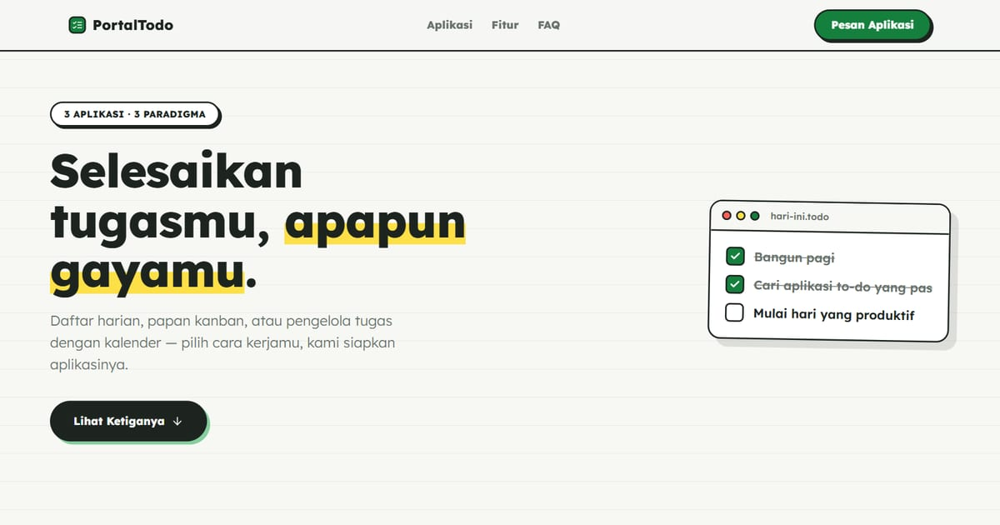

# PortalTodo — Tiga Cara Menaklukkan Harimu

PortalTodo: koleksi 3 aplikasi to-do dengan paradigma berbeda — checklist klasik, papan kanban, dan task manager lengkap.

**Demo live:** https://portal-todo.vercel.app



> Katalog demo milik PintuWeb. Setiap kartu menautkan ke demo live yang bisa dicoba.

## Konsep

Katalog aplikasi to-do. Gaya buku catatan: kertas bergaris, kartu to-do hidup di hero, dan pratinjau berbingkai jendela aplikasi.

## Varian yang dipamerkan (3)

- [Hari Ini](https://todo-classic.vercel.app)
- [Lajur](https://todo-kanban-one.vercel.app)
- [Tuntas](https://todo-manager-ivory-seven.vercel.app)

## Halaman

`/`

## Teknologi

- Next.js 15.5 (App Router) dan React 19
- Tailwind CSS v4
- JavaScript
- Framer Motion, Lucide (ikon)
- Font: Lexend (next/font)
- SEO: metadata per halaman, Open Graph, JSON-LD, sitemap.xml, dan robots.txt

## Menjalankan secara lokal

```bash
npm install
npm run dev
```

Buka http://localhost:3000. Untuk build produksi: `npm run build` lalu `npm start`.

---

Dibuat oleh [PintuWeb](https://pintuweb.com), jasa pembuatan website.
